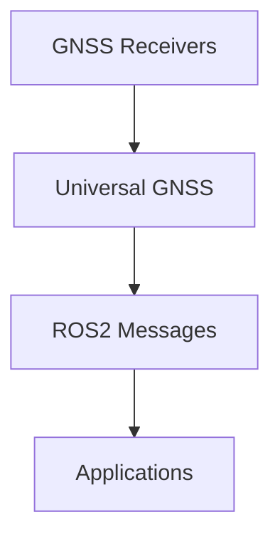

  
  
  
  
    

  
  
  
  
  
  
  
    

# Universal GNSS

Universal GNSS is a modular GNSS/RTK runtime stack designed for ROS 2, embedded systems, and RTK base stations.

The goal is to provide a vendor-agnostic GNSS layer capable of parsing, normalizing, configuring, and exposing GNSS data from multiple receiver families through a common runtime model.

## Current Project Status

`v0.6.0` is released.

Current phase: post-`v0.6.x` stabilization.

Current project state includes:

- Auto Discovery v2 plus `ReceiverNode` auto-discovery wiring
- Auto Configuration dry-run planning and operator-driven apply for supported
  families
- `ReceiverNode`, `NtripNode`, and `ReplayNode`
- parser counters plus malformed/rejected diagnostic visibility in ROS2
- live RTCM forwarding from `NtripNode` into `ReceiverNode`
- portable RTCM MSM correction-stream summary observability through the shared
  semantic monitor/tools surface
- ROS2 RTCM semantic diagnostics for base-station ARP, `1230`, and MSM summary
- additive portable dual-antenna baseline runtime/ROS2 surface:
  - capabilities:
    `dual_antenna_baseline`, `baseline_azimuth`, `baseline_pitch`,
    `baseline_length`, `baseline_solution_status`
  - runtime / `GnssStatus` fields:
    `dual_antenna_baseline`, `baseline_azimuth_deg`,
    `baseline_pitch_deg`, `baseline_length_m`,
    `baseline_solution_status`
  - compatibility fields:
    `heading_deg` and `dual_antenna_heading` remain during `v0.6.x`
- u-blox persistent FLASH configuration and output-port selection
- model-aware Unicore signal-group planning/profile selection with:
  - safe unknown-model fallback that skips `CONFIG SIGNALGROUP`
  - documented UM982 dual-antenna baseline gating
  - documented UM980 / UB9A0 single-antenna signal-group validation
  - explicit known non-baseline model selection for UM960 / UM981 without
    guessing undocumented signal-group mappings
- Unicore binary `N4` regression coverage for valid unknown-frame accounting,
  malformed/rejected decode handling, and ASCII/Binary portable-field
  consistency on shared `PVTSLN*` mappings
- UM982 / Unicore runtime field validation through downstream MowgliNext use
- decimal-degree latitude/longitude outputs preserving at least 9 decimal
  places

Current release guidance:

- live receiver writes do not occur unless `gnss_config_apply` is given
  explicit `--confirm` or `--yes`
- Unicore persistent apply is available through the reset/recovery workflow and
  remains an operator-driven path with manual rollback expectations
- Unicore `gnss_profile_preview`, `gnss_config_plan`, and `gnss_config_apply`
  accept an optional `--model` selector; when the model is unknown, the safe
  fallback skips `CONFIG SIGNALGROUP` and leaves the receiver's current
  signal-group configuration unchanged
- Unicore `factory_reset` live execution now uses the same reconnect / active
  probe recovery workflow
- stable `/dev/serial/by-id/*` paths are recommended over transient
  `/dev/ttyACM*` and `/dev/ttyUSB*` names whenever they exist
- UM982 runtime-only live apply should use an operator timeout around
  `--timeout-ms 5000`
- MowgliNext is treated as downstream field validation; GUI/install issues do
  not belong in the Universal GNSS core backlog unless they expose a missing
  portable feature or a bug in this repository

## Portable Receiver Profiles

The current portable receiver-configuration surface is:

- `runtime_only`
  - do not change receiver configuration
  - only open the receiver and parse its current output
- `rover_high_precision`
  - configure a conservative high-precision rover/runtime output profile
- `rover_high_precision_debug`
  - extend `rover_high_precision` with extra satellite / RF / hardware /
    correction diagnostics where supported
- `factory_reset`
  - model a receiver factory-reset workflow where the vendor support is known
  - requires explicit reconnect/recovery handling before normal profile apply resumes

Legacy aliases are still accepted by the current CLIs:

- `rover` -> `rover_high_precision`
- `diagnostics` -> `rover_high_precision_debug`

Current receiver-family support:

- Unicore
  - `runtime_only`
  - `rover_high_precision`
  - `rover_high_precision_debug`
  - `factory_reset` planning/preview/live recovery apply
  - model-aware signal-group planning:
    - `UM960` and `UM981` are known non-baseline models and stay conservative
      when signal-group mappings are undocumented
    - `UM982` may emit the documented dual-antenna rover selection
      `CONFIG SIGNALGROUP 3 6`
    - `UM980` and `UB9A0` expose documented explicit signal-group selections
      but do not auto-enable dual-antenna baseline groups
    - unknown/unconfirmed models skip `CONFIG SIGNALGROUP` and warn instead of
      guessing
- u-blox
  - `runtime_only`
  - `rover_high_precision`
  - `rover_high_precision_debug`
  - `factory_reset` currently reported as unsupported by the portable planner
- generic NMEA
  - `runtime_only` only
  - read-side RTK status can be inferred from standard `GGA fix_quality`

Safety note:

- receiver factory reset may change the active baud rate
- the current Unicore `FRESET` path returns the receiver to `115200 bps`
- the current Unicore recovery workflow uses an active `VERSIONA` query plus
  explicit `CONFIG COM1 921600 8 n 1` recovery before continuing the profile

Universal GNSS currently exposes this receiver-profile surface through:

- the module-level planner/profile API in `gnss_driver`
- the standalone `gnss_profile_preview`, `gnss_config_plan`, and
  `gnss_config_apply` CLIs
- downstream integration hooks for ROS2 nodes, launch files, and later
  project-specific onboarding or UI layers

## Goals

- Provide a portable GNSS core independent from ROS 2.
- Normalize GNSS runtime state across vendors.
- Support NMEA, RTCM3, u-blox UBX, Unicore, Quectel, and other protocols progressively.
- Expose consistent ROS 2 topics, services, and diagnostics.
- Support RTK rover and RTK base workflows.
- Keep parser, driver, transport, NTRIP, and ROS 2 layers separated.

## Non-goals

- Supporting every GNSS vendor message from day one.
- Replacing vendor tools for firmware updates.
- Mixing ROS 2 code into the portable parser core.

## Architecture

Current implemented layers:

- `gnss_core`
  - portable C++ runtime model
  - runtime aggregation of partial normalized updates
  - fix / RTK enums
  - capability and value flag system
  - canonical dual-antenna baseline fields plus `v0.6.x` heading compatibility
  - no ROS 2 dependency
- `gnss_protocols`
  - portable framing and checksum helpers
  - NMEA semantic parsing: `GGA`, `RMC`, `GSA`, `GSV`, `GST`, `VTG`, `ZDA`
  - standard `GGA fix_quality` -> normalized `rtk_mode` mapping for generic
    runtime-only receivers
  - UBX semantic parsing: `NAV-STATUS`, `NAV-PVT`, `NAV-DOP`, `NAV-SAT`,
    `MON-HW`, `MON-HW2`, `MON-RF`, `RXM-RTCM`, `ACK/NAK`
  - Unicore ASCII semantic parsing: `PVTSLNA`, `BESTNAVA`, `RTKSTATUSA`,
    `RTCMSTATUSA`, `SATSINFOA`, `BESTSATA`, `JAMSTATUSA`, `FREQJAMSTATUSA`,
    `HWSTATUSA`, `AGCA`
  - Unicore binary `N4` semantic parsing: `BESTNAVB`, `PVTSLNB`
  - RTCM3 framing, CRC24Q, message-type extraction/classification, and
    semantic decode for `1005`, `1006`, `1230`, and portable MSM
    header/summary observability
- `gnss_driver`
  - receiver profile declarations
  - protocol support and feature flags
  - lightweight stream-family detection and auto-discovery
  - discovery-aware planner/report layer for portable receiver configuration
- `gnss_transport`
  - portable byte source / sink interfaces
  - memory-backed test / replay transport
  - Linux POSIX serial transport
  - transport metrics and buffer helpers
- `gnss_ntrip`
  - portable NTRIP config types
  - request and auth header generation
  - GGA injection policy types
  - connection metrics models
  - synchronous live client foundation and caster-monitor support
- `gnss_tools`
  - `rtcm_inspect` CLI for RTCM-only frame inspection
  - `gnss_inspect` CLI for structural mixed-stream frame inspection
  - `gnss_replay` CLI for semantic offline runtime replay
  - `gnss_profile_preview` CLI for offline receiver command/profile review
  - `gnss_config_plan` CLI for dry-run receiver config application planning
  - `gnss_config_apply` CLI for operator-driven receiver config application
  - `gnss_serial_monitor` CLI for live Linux serial monitoring
  - `gnss_ntrip_monitor` CLI for live NTRIP caster testing
- `gnss_ros2`
  - ROS 2 package `universal_gnss_ros2`
  - `GnssStatus` message
  - `GnssRuntimeState -> GnssStatus` adapter
  - `GnssRuntimeState -> NavSatFix` adapter
  - `GnssHealthSummary -> DiagnosticArray` adapter
  - additive `GnssStatus` baseline capability constants and baseline fields
  - `ReceiverNode` publishing `fix`, `status`, and `diagnostics`
  - `ReceiverNode` serial auto-discovery support for
    `serial_device:=auto`, `serial_baud:=auto`, and `receiver_family:=auto`
  - discovery, correction, and parser-counter diagnostic reporting
  - live RTCM forwarding from ROS2 into the receiver transport when writable
  - ROS2 diagnostic projection of portable RTCM semantic observations for
    base-station ARP, GLONASS `1230`, and MSM summary/per-message activity
    without warning on well-formed `1230` messages that simply carry no valid
    GLONASS bias values
  - `ReplayNode` for hardware-free `status` / `fix` / `diagnostics` replay with
    optional `rtcm` publication from sanitized logs
  - `NtripNode` wrapper publishing diagnostics for ROS-side NTRIP state
  - serial / TCP / replay / combined launch examples

Later modules:

- `gnss_rtk_base`
  - survey-in, fixed-base workflows, RTCM routing
- `gnss_esp32`
  - lightweight embedded integration

The intended flow is:

See [docs/ros2.md](docs/ros2.md) for the ROS 2 adapter contracts, the
receiver/NTRIP node surfaces, and the current status / covariance policy.

See [docs/devcontainer.md](docs/devcontainer.md) for the reproducible ROS 2
devcontainer setup, Kilted build flow, future Lyrical switch path, and optional
serial hardware access examples.

See [docs/ros2_end_to_end_audit.md](docs/ros2_end_to_end_audit.md) for the
current receiver-to-ROS2-to-NTRIP audit status, combined launch coverage, and
the latest real receiver and real caster hardware smoke-test notes.

See [docs/validation/README.md](docs/validation/README.md) for the current
boundary between Universal GNSS core validation, ROS2 package validation,
receiver-backend validation, and downstream integration validation.

See [docs/robot_localization.md](docs/robot_localization.md) for the first
example of connecting Universal GNSS `fix` output to
`robot_localization/navsat_transform_node` and `ekf_node`.

See [docs/protocols.md](docs/protocols.md) for the current parser coverage,
runtime mapping coverage, and intentionally deferred protocol support.

See [docs/terminology.md](docs/terminology.md) for the canonical
GNSS/geodesy-first vocabulary, the current terminology audit, and the
compatibility plan for ambiguous public names such as `heading_deg`.

See [docs/vendors/ublox/runtime_mapping.md](docs/vendors/ublox/runtime_mapping.md)
for the current u-blox-specific runtime mapping policy used by the UBX semantic
layer.

See [docs/vendors/unicore/runtime_mapping.md](docs/vendors/unicore/runtime_mapping.md)
for the current Unicore ASCII runtime mapping policy and extraction boundary
from earlier Mowgli-specific prototypes.

See [docs/driver.md](docs/driver.md) for the current driver-layer boundary,
receiver profiles, and stream-detection foundation.

See [docs/runtime_aggregation.md](docs/runtime_aggregation.md) for the generic
merge rules that combine partial protocol/runtime updates into one coherent
`GnssRuntimeState`.

See [docs/tools.md](docs/tools.md) for the current offline inspection CLIs,
profile preview, config-plan, config-apply usage examples, runtime
replay usage examples, and the live serial / NTRIP monitors.

See [docs/transport.md](docs/transport.md) for the current portable byte-stream
abstraction layer and memory transport behavior.

See [docs/ntrip.md](docs/ntrip.md) for the current NTRIP layer scope,
request-format policy, and deferred networking work.

## License

This project is licensed under LGPLv3.

## Support the project

If Universal GNSS helps your projects and you would like to support development:

☕ Buy me a coffee:
https://buymeacoffee.com/x8ndjtgsrwg

Your support helps fund:
- GNSS hardware (u-blox, Unicore, Quectel, etc.)
- RTK testing
- CI infrastructure
- Documentation and tooling

## Trademarks

u-blox®, Unicore®, Quectel®, and Septentrio® are trademarks of their respective owners.

Universal GNSS is an independent open-source project and is not affiliated with, endorsed by, or sponsored by any of these companies.
